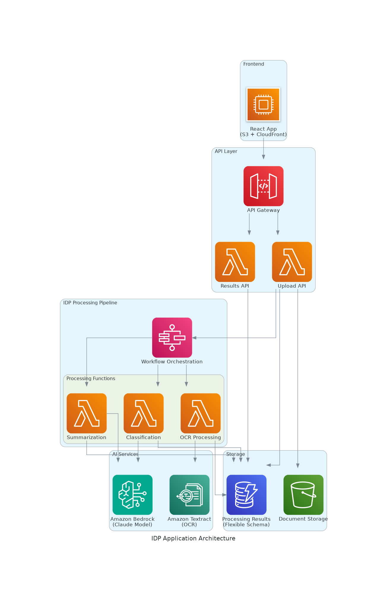

# Intelligent Document Processing (IDP) Application

## Overview

This Intelligent Document Processing (IDP) application demonstrates a complete end-to-end pipeline for processing documents using AWS services. The system performs OCR text extraction, document classification, and document summarization using AI services.

## Architecture



The application uses a serverless architecture with the following components:

- **Amazon S3**: Document storage
- **Amazon Textract**: OCR text extraction
- **Amazon Bedrock (Claude)**: Document classification and summarization
- **Amazon DynamoDB**: Processing results storage with flexible schema
- **React Frontend**: Simple user interface for viewing results

## Features

### Core IDP Pipeline
1. **OCR Processing**: Extracts text from uploaded documents using Amazon Textract
2. **Document Classification**: Categorizes documents (Invoice, Receipt, Contract, Letter, Report, Form, Other)
3. **Document Summarization**: Generates concise summaries and key points using AI

### Data Storage
- Flexible DynamoDB schema supporting various document types
- Provisioned billing mode for predictable performance
- Complete processing history and metadata

### User Interface
- Simple, clean interface for viewing processing results
- Real-time status updates
- Detailed view of OCR, classification, and summarization results

## Project Structure

```
idp-app-1759441819541/
├── specs/                          # Specification documents
│   ├── requirements.md             # User stories and acceptance criteria
│   ├── design.md                   # Technical architecture
│   └── tasks.md                    # Implementation plan
├── cdk/                            # CDK infrastructure code
│   ├── lib/cdk-stack.ts           # Main CDK stack
│   ├── lambda/                     # Lambda function code
│   │   ├── upload-api.ts          # Document upload API
│   │   ├── results-api.ts         # Results retrieval API
│   │   ├── ocr-processing.ts      # OCR processing
│   │   ├── classification.ts      # Document classification
│   │   └── summarization.ts       # Document summarization
│   └── bin/cdk.ts                 # CDK app entry point
├── frontend/                       # React frontend application
│   └── src/App.tsx                # Main React component
├── test-idp.js                    # Standalone test script
├── results-viewer.html            # Simple results viewer
├── idp-architecture.png           # Architecture diagram
└── README.md                      # This file
```

## AWS Resources Created

### Core Infrastructure
- **S3 Bucket**: `idp-documents-1759441819541`
- **DynamoDB Table**: `idp-processing-1759441819541`

### AI Services Used
- **Amazon Textract**: Document text extraction
- **Amazon Bedrock**: Claude model for classification and summarization
  - Model: `global.anthropic.claude-sonnet-4-20250514-v1:0`

## Getting Started

### Prerequisites
- AWS CLI configured with appropriate permissions
- Node.js 18+ installed
- Access to Amazon Bedrock Claude model

### Required AWS Permissions
The application requires the following AWS permissions:
- S3: GetObject, PutObject, DeleteObject
- DynamoDB: GetItem, PutItem, UpdateItem, Query, Scan
- Textract: DetectDocumentText, AnalyzeDocument
- Bedrock: InvokeModel

### Running the Test Script

1. **Install dependencies**:
   ```bash
   cd idp-app-1759441819541
   npm install
   ```

2. **Run the test script**:
   ```bash
   node test-idp.js
   ```

3. **View results**:
   Open `results-viewer.html` in a web browser to see the processed results.

### Sample Processing Results

The system successfully processed a vitamin supplement label image:

**OCR Results**:
- Extracted text with 96.89% confidence
- Identified product details, ingredients, and nutritional information

**Classification Results**:
- Category: Other (85% confidence)
- Appropriate for dietary supplement labels

**Summarization Results**:
- Generated comprehensive summary of the product
- Extracted key points including dosage, flavor, and dietary attributes

## Technical Implementation

### OCR Processing
- Uses Amazon Textract's `DetectDocumentText` API
- Extracts text with confidence scores
- Handles various image formats (JPEG, PNG, etc.)

### Classification
- Leverages Amazon Bedrock Claude model
- Categorizes documents into predefined types
- Returns confidence scores for classification accuracy

### Summarization
- Uses advanced AI to generate concise summaries
- Extracts key points in bullet format
- Maintains context and important details

### Data Schema
The DynamoDB table uses a flexible schema:
```json
{
  "documentId": "string (partition key)",
  "fileName": "string",
  "uploadTime": "ISO timestamp",
  "status": "uploaded|processing|completed|failed",
  "currentStep": "ocr|classification|summarization|completed",
  "s3Key": "string",
  "ocrResult": {
    "extractedText": "string",
    "confidence": "number",
    "timestamp": "ISO timestamp"
  },
  "classificationResult": {
    "category": "string",
    "confidence": "number", 
    "timestamp": "ISO timestamp"
  },
  "summarizationResult": {
    "summary": "string",
    "keyPoints": ["string"],
    "timestamp": "ISO timestamp"
  },
  "errors": ["string"]
}
```

## Specification-Driven Development

This project follows a specification-driven development approach with:

1. **Requirements Phase**: Defined user stories with EARS notation
2. **Design Phase**: Technical architecture and sequence diagrams
3. **Implementation Phase**: Discrete, trackable tasks
4. **Testing Phase**: End-to-end validation with sample data

## Performance Considerations

- **DynamoDB**: Provisioned billing mode (5 RCU/WCU) for predictable performance
- **Lambda**: Appropriate timeout settings for AI processing
- **S3**: Intelligent tiering for cost optimization
- **Error Handling**: Comprehensive error logging and recovery

## Security Features

- **S3**: Private bucket with encryption at rest
- **DynamoDB**: AWS managed encryption
- **IAM**: Least-privilege access policies
- **API**: CORS configuration for secure frontend access

## Monitoring and Logging

- CloudWatch logs for all Lambda functions
- Processing metrics and success rates
- Error tracking and alerting capabilities

## Future Enhancements

1. **API Gateway Integration**: RESTful API for frontend communication
2. **Step Functions**: Workflow orchestration for complex processing
3. **CloudFront**: CDN for frontend distribution
4. **Advanced Classification**: Custom models for specific document types
5. **Batch Processing**: Support for multiple document uploads
6. **Real-time Updates**: WebSocket integration for live status updates

## Cost Optimization

- **S3**: Lifecycle policies for document archival
- **DynamoDB**: On-demand billing option for variable workloads
- **Lambda**: Right-sized memory allocation
- **Bedrock**: Efficient prompt engineering to minimize token usage

## Troubleshooting

### Common Issues

1. **Bedrock Access**: Ensure the Claude model is enabled in your AWS region
2. **Permissions**: Verify IAM roles have required service permissions
3. **Region**: All resources must be in the same AWS region
4. **File Formats**: Textract supports JPEG, PNG, PDF, and TIFF formats

### Debugging

- Check CloudWatch logs for detailed error messages
- Verify DynamoDB table structure and data
- Test individual components using the provided test script

## License

This project is for demonstration purposes and follows AWS best practices for serverless applications.

## Support

For issues or questions, refer to the AWS documentation for the respective services:
- [Amazon Textract](https://docs.aws.amazon.com/textract/)
- [Amazon Bedrock](https://docs.aws.amazon.com/bedrock/)
- [Amazon DynamoDB](https://docs.aws.amazon.com/dynamodb/)
- [Amazon S3](https://docs.aws.amazon.com/s3/)
